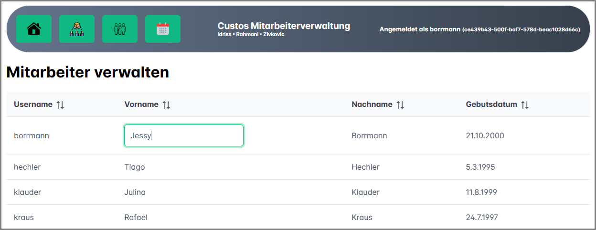

# Diplomarbeit Custos Mitarbeiterverwaltungssystem (2023/24)

```
git clone https://github.com/Die-Spengergasse/sj23-24-5aaif-da-custos-employeemanager
```



## Themenstellungen

| Name                     | Individuelle Themenstellung                                                                                                                    |
| ------------------------ | ---------------------------------------------------------------------------------------------------------------------------------------------- |
| Muayad Idriss (5AAIF)    | Implementierung eines Kalenders, der die österreichischen Feiertage   berücksichtigt und im Web und als ICAL auf dem Smartphone verfügbar ist. |
| Arash Rahmani (5AAIF)    | Entwicklung eines Systems zur Erfassung der Aufträge, so dass sie von den   einzelnen Mitarbeitern angenommen werden können.                   |
| Mihajlo Zivkovic (5AAIF) | Implementierung einer Webanwendung zum Migrieren und Bearbeiten von   Mitarbeiterdaten aus externen Quellen.                                   |

Betreuer: Michael Schletz

## Installation der Entwicklungsumgebung

Die Webapp benötigt **.NET 8** (Visual Studio ab 17.8) und [Node.js](https://nodejs.org/en) ab Version 20.
Für die Entwicklung wird VS Code mit folgenden Extensions empfohlen:

- [ESLint](https://marketplace.visualstudio.com/items?itemName=dbaeumer.vscode-eslint)
- [Volar](https://marketplace.visualstudio.com/items?itemName=Vue.volar)

### Starten des Servers

Führe das Skript [EmployeeManager/start_server.sh](EmployeeManager/start_server.sh) in der git bash aus.
Es wird ein Build der SPA durchgeführt und die Webapi wird gestartet.
Es ist jedes Login gültig.
